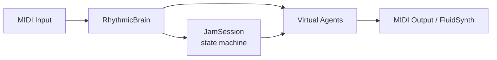

# Jam Shed 🎸🥁

**Jam Shed** is an AI-powered interactive music jamming application for drummers that lets you jam with a full virtual band. Connect your MIDI e-drums and AI musicians will listen to your playing in real time, learn your grooves, trade solos with you, and respond to your musical ideas.

## Features

- 🎵 **Real-time MIDI drum jamming** — AI responds to every hit you play
- 🧠 **Rhythmic learning** — the AI memorises your grooves and plays them back
- 🎭 **Five virtual instrumentalists** — Bassist, Lead Guitarist, Rhythm Guitarist, Keyboardist, Drummer
- 🎨 **Six musical styles** — Rock, Jazz, Hip-Hop, Blues, Funk, Latin
- 🔄 **Three session modes** — Shed (trading solos), Groove (call-and-response), Jam (AI-directed ensemble)
- 📊 **Live visual feedback** — scrolling notation and per-agent activity
- 🎼 **Full music theory engine** — scales, chord progressions, chord-tone soloing
- 🖥️ **Terminal UI** — fast, keyboard-navigable interface powered by [Textual](https://textual.textualize.io/)
- 🔊 **Built-in audio** — play without external hardware via FluidSynth

## Requirements

- Python 3.11+
- A MIDI e-drum kit **or** use your computer keyboard
- macOS / Linux / Windows
- [FluidSynth](https://www.fluidsynth.org/) (optional, for local audio output)

## Installation

### With `uv` (recommended)

```bash
git clone https://github.com/jweisz/jam-shed.git
cd jam-shed
uv pip install -e .

# Optional: download GM soundfonts for built-in audio
uv run python scripts/download_soundfonts.py
```

### With `pip`

```bash
pip install -e .
python scripts/download_soundfonts.py
```

## Quick Start

```bash
# Start the app
mise run start
# or
uv run python -m jam_shed.tui.app
```

1. **Select MIDI In/Out** from the dropdowns and click **Connect**
2. **Enable agents** using the checkboxes (Bass, Lead Guitar, Rhythm Guitar, Keys)
3. **Choose a key, scale, and style**
4. **Pick a mode** — Shed, Groove, or Jam — and start playing

## Session Modes

### Shed Mode (Trading Solos)

You and the AI take turns soloing in configurable bar lengths (2, 4, or 8 bars). The AI listens during your turn, then plays back a response. Ideal for practising call-and-response phrasing.

### Groove Mode (Call and Response)

An 8-bar cycle split in two: you play a 4-bar groove, then the AI copies and extends it for 4 bars. The drummer learns your exact rhythmic pattern and mirrors it back.

### Jam Mode (AI Ensemble)

The AI arranger manages a full band through a dynamic progression of sections — INTRO → GROOVE ESTABLISH → CONVERSATION → SPOTLIGHT → RETURN GROOVE → OUTRO. Agents shape their density, complexity, and solo probability in real time based on your playing energy.

## AI Virtual Musicians

All agents inherit from `VirtualInstrumentalist` and share a common motif/endurance model. Each has style-specific behaviour configured via `agents/style_calibration.py`.

| Agent | Channel | Subdivision | Notes |
| --- | --- | --- | --- |
| `VirtualBassist` | 3 | 8th notes | Chord-root weighting, kick-following |
| `VirtualLeadGuitarist` | 1 | 16th notes | Chord-tone soloing, spotlight boost |
| `VirtualRhythmGuitarist` | 2 | 8th notes | Style-strumming patterns |
| `VirtualKeyboardist` | 4 | 8th–16th notes | Chord voicing, montuno |
| `VirtualDrummer` | 9 | 16th notes | Ostinato kick, learned grooves, response fills |

## Project Structure

```txt
jam-shed/
├── src/jam_shed/
│   ├── agents/
│   │   ├── base.py              # VirtualInstrumentalist base class
│   │   ├── bassist.py
│   │   ├── drummer.py
│   │   ├── lead_guitarist.py
│   │   ├── rhythm_guitarist.py
│   │   ├── keyboardist.py
│   │   ├── factory.py           # AgentFactory
│   │   └── style_calibration.py # Central style tuning values
│   ├── core/
│   │   ├── brain.py             # RhythmicBrain — tempo, pattern learning
│   │   ├── session.py           # JamSession — state machine
│   │   ├── theory.py            # MusicTheory — scales, chords
│   │   ├── audio.py             # AudioEngine (FluidSynth)
│   │   └── constants.py
│   ├── midi/
│   │   ├── engine.py            # MIDIEngine — rtmidi wrapper
│   │   └── message.py
│   └── tui/
│       ├── app.py               # JamShedApp (Textual)
│       └── visual.py            # Groove visualiser widgets
├── tests/
│   ├── conftest.py              # Shared fixtures (including mock_midi)
│   ├── mock_midi.py             # MockMIDIEngine for hardware-free testing
│   ├── test_agent_behavior.py   # Per-agent unit/integration tests
│   ├── test_agent_integration.py
│   ├── test_brain.py
│   ├── test_session.py
│   ├── test_theory.py
│   └── ...
├── assets/soundfonts/           # GM soundfonts (downloaded separately)
├── scripts/download_soundfonts.py
├── mise.toml                    # Task runner
└── pyproject.toml
```

## Development

### Tasks

```bash
mise run start      # Launch the TUI app
mise run test       # Run the test suite (pytest)
mise run typecheck  # Run mypy type checker
```

### Running tests manually

```bash
uv run pytest -q            # All tests
uv run pytest tests/test_agent_behavior.py -v   # Agent tests only
```

### Testing without MIDI hardware

Tests use `MockMIDIEngine` (`tests/mock_midi.py`) which records all outgoing MIDI messages and can replay scripted input sequences. No physical devices required.

```python
from mock_midi import MockMIDIEngine

midi = MockMIDIEngine()
midi.open_output("out")
bassist = VirtualBassist("Bass", midi, brain, channel=3)
bassist.play_note(state, beat=0, sub_beat=0)
print(midi.get_note_on_messages())  # [(timestamp, note, velocity), ...]
```

## How It Works



1. **MIDI Input** — your device sends note and timing events via `rtmidi`
2. **RhythmicBrain** — tracks tempo, logs agent/human activity into a rolling 8-bar history
3. **JamSession** — advances the bar/beat counter, manages mode transitions and soloist turns
4. **Virtual Agents** — each `tick()` call decides whether to play based on motif, endurance, phase, and musical context
5. **MIDI Output** — notes go to an external synth or the built-in FluidSynth engine

## Troubleshooting

**MIDI device not listed?**
Connect your e-drum device before launching. On macOS, open *Audio MIDI Setup* to confirm it is recognised. Restart the app after connecting.

**No sound with built-in audio?**
Run `uv run python scripts/download_soundfonts.py` to fetch the required soundfonts, then select *Local (Fluidsynth)* as the MIDI output.

**Agents are silent?**
Check that: (1) MIDI output is connected, (2) agents are enabled via checkboxes, (3) you are in an active session mode (not just the default waiting state).

## Contributing

Issues and pull requests are welcome. Please run `mise run test` and `mise run typecheck` before submitting a PR.

## License

MIT License — see `LICENSE` for details.

## Credits

- [Textual](https://textual.textualize.io/) — TUI framework
- [python-rtmidi](https://spotlightkid.github.io/python-rtmidi/) — MIDI I/O
- [FluidSynth](https://www.fluidsynth.org/) / [pyfluidsynth](https://github.com/nwhitehead/pyfluidsynth) — software synthesizer
- [mido](https://mido.readthedocs.io/) — MIDI file/message handling

---

Happy jamming! 🎶
